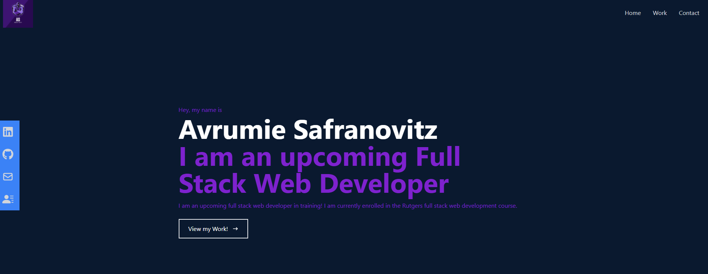

# Professional Portfolio

## Description

Using React, create a professional portfolio to showcase my work.
The site was generated with a mobile first approach. As such, the site displays properly across across all media widths. The site also uses "Getfolio" to capture user imput in the form section.

## Testing Instructions

Once on the site, a user can click on a the nav bar header to be taken to a section of the site. The navbar uses "react smooth scrolling" for a nice user experience.

## Screenshot og app in use:

## Built With:

- Javascript
- React
- HTML
- CSS
- React Scroll
- Tailwinds CSS
- Post CSS
- Google Fonts
- Getfolio

## Additional Sources

"CodeCommerce" greatly helped in my understanding of React and building this application.

## Contribution:

Made with ❤️ by Avrumie Safranovitz
